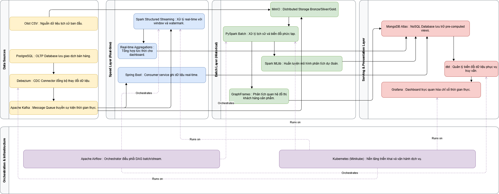

<div align="center">

# Hệ Thống Xử Lý Dữ Liệu Lớn Bán Hàng (Big Data E-Commerce Platform)

Dự án xây dựng nền tảng dữ liệu lớn (Big Data) ứng dụng **Kiến trúc Lambda (Lambda Architecture)** để xử lý và phân tích dữ liệu cho một hệ thống bán hàng thương mại điện tử.

</div>

---

## Giới Thiệu Tổng Quan

Dự án này được thiết kế để giải quyết bài toán dữ liệu lớn của một hệ thống E-commerce, tập trung vào hai luồng xử lý chính để đảm bảo tính toàn vẹn và tốc độ phản hồi của dữ liệu:

1. **Luồng Batch (Batch Processing Layer)**: 
   - Nhiệm vụ: Xử lý khối lượng lớn dữ liệu giao dịch (đơn hàng, thanh toán, v.v.) được ghi nhận từ cơ sở dữ liệu OLTP (PostgreSQL) thông qua cơ chế Change Data Capture (CDC).
   - Mục đích: Tổng hợp, làm sạch và tính toán các chỉ số kinh doanh cốt lõi (doanh số, tăng trưởng, xu hướng) theo chu kỳ, phục vụ cho hệ thống báo cáo và Data Warehouse.
2. **Luồng Streaming (Speed/Streaming Layer)**: 
   - Nhiệm vụ: Xử lý luồng sự kiện hành vi người dùng (User Behavior - click, view, add_to_cart) theo thời gian thực (Real-time).
   - Mục đích: Đưa ra các gợi ý sản phẩm (Next-product recommendations) ngay lập tức cho người dùng, tối ưu hóa trải nghiệm mua sắm và tăng tỷ lệ chuyển đổi.

---

## Kiến Trúc Hệ Thống (Lambda Architecture)

Hệ thống được thiết kế theo chuẩn Medallion Architecture (Bronze - Silver - Gold) kết hợp với các công cụ mã nguồn mở hàng đầu trong hệ sinh thái Big Data.



*(Ảnh minh họa: Cấu trúc đường ống dữ liệu (Data Pipeline) từ khi sinh ra cho đến khi lưu trữ ở các dạng tối ưu)*

### Công Nghệ Sử Dụng

- **Dữ liệu nguồn (OLTP)**: PostgreSQL
- **Data Ingestion & CDC**: Kafka, Debezium, Kafka Connect (S3 Sink)
- **Data Processing**: Apache Spark (PySpark)
  - *Spark Batch*: Chạy qua Airflow (SparkSubmitOperator).
  - *Spark Streaming*: Xử lý dữ liệu liên tục từ Kafka.
- **Data Storage (Datalake/Data Warehouse)**:
  - Object Storage: MinIO (tương thích S3) lưu trữ dữ liệu dạng Parquet (Bronze & Silver).
  - NoSQL: MongoDB (local container và MongoDB Atlas) lưu trữ dữ liệu dạng Document cho ứng dụng (Gold).
- **Orchestration**: Apache Airflow
- **Triển khai & Vận hành**: Docker Compose, Kubernetes (Minikube)

---

## Cấu Trúc Thư Mục Dự Án

Dự án được phân chia thành các thư mục với mục đích chuyên biệt:

```text
C:\Work\Big-Data\
├── airflow/           # Chứa các DAGs định nghĩa luồng chạy pipeline (batch_pipeline_dag.py).
├── data/external/     # Dữ liệu CSV thô ban đầu dùng để mồi (seed) vào database.
├── docs/              # Tài liệu chi tiết về dự án, sơ đồ kiến trúc (drawio/png) và hướng dẫn.
├── init/              # Các cấu hình, scripts (SQL, bash) và Dockerfile custom (Spark, Airflow).
├── k8s/               # File cấu hình YAML để triển khai toàn bộ hệ thống lên Kubernetes.
├── services/          # Các dịch vụ phụ trợ như mô phỏng dữ liệu (SpringBoot, web).
├── spark-batch/       # Mã nguồn PySpark xử lý luồng Batch (Bronze -> Silver -> Gold).
├── spark-streaming/   # Mã nguồn PySpark xử lý luồng Streaming (hành vi người dùng).
└── Makefile           # Bộ lệnh gộp giúp thao tác nhanh (build, run, test) trên môi trường Docker/K8s.
```

---

## Hướng Dẫn Cài Đặt Và Vận Hành

Toàn bộ hệ thống có thể được khởi chạy dễ dàng thông qua các lệnh `make` được định nghĩa sẵn. Đảm bảo bạn đã cài đặt Docker, Docker Compose, và (tùy chọn) Minikube nếu muốn chạy trên Kubernetes.

### 1. Vận hành với Docker Compose

Tất cả các lệnh phải được chạy tại thư mục gốc của dự án.

```bash
# Bật toàn bộ hệ thống (build các image custom nếu cần)
make docker-up

# Đổ dữ liệu mẫu (CSV) vào PostgreSQL OLTP
make seed-postgres

# Đăng ký các Connector (Debezium source CDC & S3 Sink)
make register-connectors

# Chạy trực tiếp các luồng xử lý bằng Spark
make run-silver    # Chạy batch: Bronze -> Silver
make run-gold      # Chạy batch: Silver -> Gold (3 sinks)
make run-streaming # Chạy luồng streaming: Xử lý hành vi người dùng

# Hoặc kích hoạt chạy Batch tự động thông qua Airflow DAG
make airflow-trigger

# Tắt hệ thống
make docker-down
```

### 2. Triển khai với Kubernetes (Minikube)

```bash
# Build các image tùy chỉnh đưa vào môi trường minikube
make k8s-build-images

# Tạo ConfigMap cho mã nguồn và cấu hình
make k8s-code-configmaps

# Khởi chạy tất cả các pod/services trong K8s
make k8s-up

# Đổ dữ liệu và test trạng thái
make seed-postgres-k8s
make k8s-test-all
```

---

## Tài Liệu Hướng Dẫn Chi Tiết

Để tìm hiểu sâu hơn về từng thành phần, cấu hình và cách fix lỗi, vui lòng tham khảo các tài liệu trong thư mục [`docs/`](docs/):

- Hướng dẫn test End-to-End: [`docs/huong-dan-test.md`](docs/huong-dan-test.md)
- Chi tiết cấu hình luồng Debezium - Kafka: [`docs/guilde/debezium-kafka/`](docs/guilde/debezium-kafka/)
- Hướng dẫn triển khai K8s: [`docs/guilde/k8s-guide/`](docs/guilde/k8s-guide/)
- Kế hoạch luồng Streaming: [`docs/guilde/streaming/`](docs/guilde/streaming/)

---
*Dự án đã hoàn thành phát triển và hoàn thiện các phase, đặc biệt là luồng xử lý Streaming và hệ thống Backend/Web UI đi kèm.*