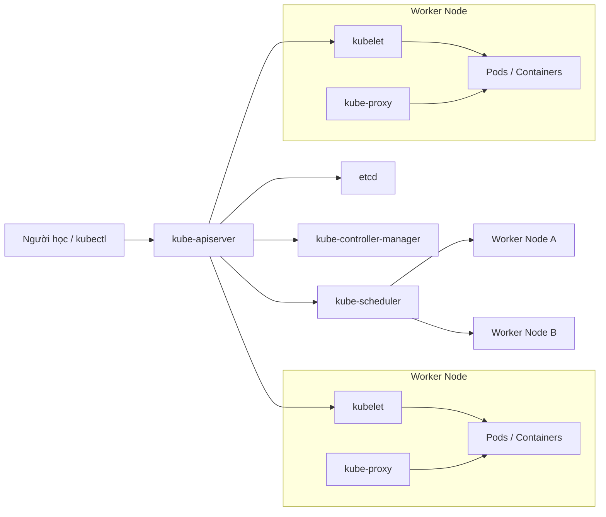
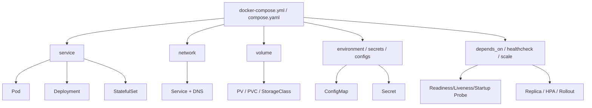
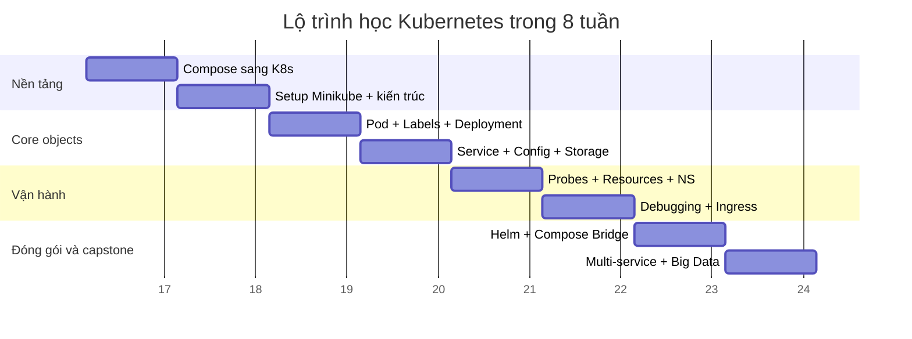

# Báo cáo chuyên sâu xây dựng giáo án Kubernetes từ Docker Compose trên Windows

## Tóm tắt điều hành

Báo cáo này thiết kế một khung giáo án Kubernetes theo đúng bối cảnh học của bạn: học trên Windows, đã biết Docker và Docker Compose, có entity["company","Docker","container platform"] Desktop, có entity["company","VMware","virtualization software"] Workstation, và cần chuyển từ tư duy container đơn máy sang triển khai hệ nhiều thành phần trên Kubernetes. Trọng tâm của giáo trình không phải là “học cho hết Kubernetes”, mà là học đúng lớp kiến thức cần để dựng, cấu hình, vận hành và debug được các hệ thống thật có cả service stateless, service stateful, lưu trữ bền vững, cập nhật không downtime, và observability cơ bản. Theo tài liệu yêu cầu dự án của bạn, đích đến còn bao gồm pipeline big data end‑to‑end với Spark, hàng đợi tin nhắn, lưu trữ tương đương HDFS, NoSQL, và triển khai bằng Kubernetes hoặc cloud, nên khóa học phải đi xa hơn Pod/Service căn bản và chạm đến PVC, StatefulSet, Ingress, Helm, rollout, HPA cơ bản, cùng migration từ Compose sang K8s. fileciteturn0file0 citeturn7view0turn7view1turn7view9turn7view8turn14view8

Từ góc nhìn công cụ, Minikube là môi trường học chính phù hợp nhất cho lộ trình này vì nó được thiết kế cho local Kubernetes phục vụ học tập và phát triển, chạy được với Docker hoặc VM, và cho phép bạn học gần với “Kubernetes thật” hơn so với chỉ dùng Docker Compose. Docker Desktop Kubernetes rất hợp để vào đề nhanh trên Windows vì bật cluster tích hợp rất tiện; kind mạnh ở local multi-node và CI; k3d rất nhẹ vì chạy k3s trong Docker; còn kubeadm cho fidelity cao nhất với production nhưng khó nhất trên Windows vì nó chỉ bootstrap cluster chứ không lo provision máy, nên thường phải đi qua VM Linux. citeturn7view18turn12view6turn12view10turn8view1turn12view8turn12view5turn8view11

Về mặt sư phạm, khóa học nên đi theo trục “Docker Compose quen thuộc → thấy được giới hạn → map sang object K8s → dựng cluster local → triển khai ứng dụng stateless → thêm network/config/storage → bổ sung health/resources/scheduling → học debug và ingress → học Helm → làm capstone migration và capstone big data”. Cách đi này bám sát cách Kubernetes định nghĩa desired state, controller loop và workload API, đồng thời tận dụng hiểu biết sẵn có của người học về image, network, volume, env và multi-container app trong Compose. citeturn8view5turn15view2turn13view4turn7view5turn7view6turn7view8

Về thời lượng, báo cáo này được viết để chuyển đổi linh hoạt sang giáo án 8 tuần hoặc 12 tuần. Với 8 tuần, nên học 2–3 chương mỗi tuần nhưng gộp lab theo mạch hệ thống; với 12 tuần, nên tách riêng các lab về storage, probes, scheduling, ingress, Helm và capstone để người học có đủ thời gian quan sát lỗi, rollout, log, event và các behavior điển hình của cluster. Với bối cảnh project big data, tuần cuối nên dành riêng cho chuyên đề Kafka + Spark + MinIO + MongoDB, chứ không nên trộn lẫn vào các tuần nhập môn. fileciteturn0file0 citeturn22view0turn22view2turn21search2turn22view3

Nguồn tài liệu nên ưu tiên bản chính thức: Kubernetes docs, Minikube docs, Docker Docs và Helm docs. Tài liệu tiếng Việt chính thức của Kubernetes hữu ích cho phần nhập môn, nhưng bản thân trang tài liệu tiếng Việt cũng cảnh báo có thể chậm hơn bản tiếng Anh; vì vậy phần nền tảng có thể dùng bản Việt để vào khái niệm, còn phần thực chiến nên bám bản tiếng Anh mới nhất. citeturn20view0turn20view1turn3search4turn8view9

## Bản đồ công cụ và kiến trúc học tập

### Mục lục báo cáo

- Bản đồ công cụ và kiến trúc học tập
- Các học phần nền tảng
- Các học phần triển khai ứng dụng
- Các học phần vận hành và quản trị
- Các học phần capstone và chuyên đề
- Phụ lục mã mẫu

### Bảng so sánh công cụ triển khai Kubernetes trên Windows

Bảng dưới đây dùng thang 1–5 theo hướng **đánh giá tổng hợp** cho người học trên Windows. Các điểm số là suy luận sư phạm từ mô hình triển khai, yêu cầu cài đặt, mức gần production và khả năng tích hợp CI của từng công cụ; phần nhận xét ngay dưới bảng nêu rõ cơ sở từ tài liệu chính thức. citeturn7view18turn12view6turn8view1turn12view8turn12view5

| Công cụ | Cài đặt trên Windows | Tài nguyên máy | Fidelity với production | Ease of learning | CI integration | Kết luận ngắn |
|---|---:|---:|---:|---:|---:|---|
| Minikube | 4/5 | 3/5 | 4/5 | 5/5 | 3/5 | Lựa chọn học chính cân bằng nhất |
| Docker Desktop Kubernetes | 5/5 | 3/5 | 4/5 | 5/5 | 2/5 | Bật nhanh nhất, rất hợp để vào đề |
| kind | 4/5 | 4/5 | 4/5 | 4/5 | 5/5 | Tốt nhất cho local multi-node và CI |
| k3d | 4/5 | 5/5 | 3/5 | 4/5 | 4/5 | Nhẹ, nhanh, học cụm nhỏ rất đã |
| kubeadm | 2/5 | 2/5 | 5/5 | 2/5 | 2/5 | Học sâu hạ tầng, không nên bắt đầu bằng nó |

Minikube được định vị là local Kubernetes để học và phát triển; chỉ cần Docker hoặc môi trường VM là có thể `minikube start`. Tài liệu khởi động của Minikube còn nêu rõ yêu cầu tối thiểu 2 CPU, 2GB RAM, 20GB disk, và trên Windows có thể dùng các hypervisor như Hyper‑V hoặc VMware Workstation. Docker driver cho Minikube cài trên Docker hiện có, còn Hyper‑V driver là cách đi tự nhiên nếu bạn muốn VM‑style cluster trên Windows. Minikube cũng có profile, addon và tài liệu chạy trong CI, nên điểm học tập cao và điểm CI ở mức khá. citeturn19view3turn12view1turn12view2turn17search1turn17search4

Docker Desktop có installer chính thức cho Windows, hỗ trợ WSL2 hoặc Hyper‑V, yêu cầu tối thiểu 8GB RAM, và bật Kubernetes trực tiếp từ giao diện. Từ phiên bản hiện tại, Docker Desktop cho phép provision cluster bằng `kubeadm` hoặc `kind`; trong đó `kind` nhanh hơn, hỗ trợ multi-node và chọn version, còn `kubeadm` là single-node và chậm hơn. Vì vậy Docker Desktop là điểm vào dễ nhất cho người mới, nhưng ít “thuần CI” hơn kind do sản phẩm thiên về desktop workflow. citeturn12view6turn12view10

kind là local cluster chạy bằng các Docker container node, được thiết kế chủ yếu cho testing nhưng cũng dùng tốt cho local development và CI; tài liệu chính thức của kind còn có hẳn phần “Using KIND in CI”. Đây là lý do kind có điểm CI cao nhất trong nhóm local clusters. citeturn8view1turn12view7turn17search3

k3d là wrapper CLI để tạo cluster k3s trong Docker, hỗ trợ single-node lẫn multi-node, và hệ sinh thái của nó có cả action cho GitHub. Điểm mạnh của k3d là nhẹ, nhanh và phù hợp với máy không quá dư tài nguyên; điểm đổi lại là nó cho trải nghiệm k3s hơn là “vanilla Kubernetes”, nên fidelity thấp hơn Minikube/kubeadm một nấc. citeturn12view8turn12view9turn17search18

kubeadm là fast path theo best practice để tạo cluster tối thiểu có thể qua Kubernetes conformance, nhưng tài liệu cũng nói rõ kubeadm chỉ lo bootstrap chứ không lo provisioning máy. Điều đó khiến kubeadm cho fidelity rất cao nhưng không thân thiện cho người học Windows nếu chưa quen VM Linux, networking và bootstrap control plane. citeturn12view5turn8view11turn10search0

### Sơ đồ kiến trúc control plane của Kubernetes



Kubernetes cluster gồm control plane và một hoặc nhiều worker node; kube‑apiserver là front door của control plane, controller manager chứa các control loop, scheduler đặt Pod lên node phù hợp, còn kubelet là node agent trên mỗi node. Đây là nền tảng tư duy cho toàn bộ khóa học và là lý do mọi chương sau đều xoay quanh desired state, reconciliation và workload APIs thay vì “SSH vào máy rồi chạy container”. citeturn7view1turn6search21turn6search13turn4search13

### Sơ đồ mapping Docker Compose sang Kubernetes



Compose định nghĩa services, networks, volumes, configs/secrets và một số startup semantics trong một file YAML; Kubernetes tách những concerns đó thành nhiều API object chuyên dụng như Pod, Deployment, StatefulSet, Service, ConfigMap, Secret và PVC. Compose Bridge của Docker có thể tự động sinh manifest K8s từ file Compose, nhưng giá trị học lớn nhất vẫn là hiểu sự tách nhỏ này để có thể tự chỉnh manifest sau khi convert. citeturn15view2turn15view3turn8view3turn18view1turn7view5turn7view6turn7view7turn7view8

### Lộ trình học tám tuần



Lộ trình 8 tuần này ưu tiên Minikube làm “cluster học chính”, Docker Compose làm “cầu nối tư duy”, Docker Desktop Kubernetes làm “môi trường đối chiếu”, và Compose Bridge làm “kính soi mapping”. Nếu mở rộng thành 12 tuần, bạn chỉ cần tách riêng storage, ingress, Helm và capstone big data thành các tuần độc lập với nhiều thời gian debug hơn. citeturn7view18turn8view3turn18view1turn14view8

### Quy ước môi trường lab

Tất cả lab trong báo cáo giả định máy Windows có Docker Desktop, kubectl, Minikube dùng Docker driver hoặc Hyper‑V, và một repo học tập chứa hai workspace: `labs/web-api-db` và `labs/bigdata`. Minikube tự cấu hình kubectl context khi start cluster; nếu chưa có kubectl cục bộ, Minikube vẫn có thể gọi `minikube kubectl -- ...`. Trên Windows, Docker Desktop yêu cầu WSL2 hoặc Hyper‑V và ít nhất 8GB RAM; Minikube yêu cầu tối thiểu thấp hơn nhưng nếu chạy đồng thời DB, Kafka, Spark và MinIO trên một máy, bạn nên xem 8GB chỉ là mức sàn chứ không phải mức học thoải mái. citeturn19view3turn23search19turn12view6

## Các học phần nền tảng

### Từ Docker Compose đến Kubernetes

**Mục tiêu học phần**

- Phân biệt được phạm vi của Compose và Kubernetes bằng ít nhất 5 tiêu chí.
- Tự map được `service`, `network`, `volume`, `environment`, `secrets`, `depends_on` sang object K8s tương ứng.
- Giải thích được vì sao K8s dùng desired state và controller thay vì imperative container lifecycle.
- Tự convert được một Compose file đơn giản sang manifest K8s và nhận xét đúng ít nhất 3 điểm cần chỉnh tay.

**Nội dung phân tích**

Docker Compose đơn giản hóa multi-container app bằng một file YAML mô tả services, networks, volumes và runtime options. Nó mạnh ở local development, CI, và các stack nhỏ cần khởi động nhanh; các container trong cùng một project được gắn vào một network mặc định và khám phá nhau bằng service name. Kubernetes lại giải bài toán khác: orchestration cho containerized workloads và services bằng mô hình declarative, controller và desired state. Khi học K8s, mục tiêu là chuyển từ “tôi chạy 3 container liên kết với nhau” sang “tôi muốn trạng thái hệ thống cuối cùng là 3 lớp tài nguyên có health, scale, config rời image và storage bền vững”. citeturn8view5turn8view6turn7view0turn13view4

So sánh Compose với K8s không nên dừng ở việc “service tương đương Pod”. `service` trong Compose gần hơn với một workload definition; khi sang K8s, bạn thường phải tách thành Pod template + Deployment hoặc StatefulSet + Service + ConfigMap/Secret + PVC. `depends_on` trong Compose kiểm soát thứ tự khởi động, còn readiness trong K8s kiểm soát thời điểm Pod nhận traffic; đây là khác biệt chức năng quan trọng. Compose Bridge có thể chuyển một file Compose thành Kubernetes manifests và Kustomize overlay, nhưng output sinh ra vẫn là điểm khởi đầu để người học đọc và tinh chỉnh, không phải thứ thay thế cho hiểu biết về probe, storage hay workload type. citeturn16view1turn16view0turn8view3turn18view1

**Lab thực hành step-by-step**

1. Tạo thư mục `labs/web-api-db`.
2. Lưu file `docker-compose.yml` mẫu ở Phụ lục.
3. Chạy baseline local:
   ```bash
   docker compose up -d
   docker compose ps
   docker compose logs api
   ```
4. Quan sát networking:
   ```bash
   docker compose exec api ping db
   ```
5. Nếu đã bật Docker Desktop Kubernetes, thử convert:
   ```bash
   docker compose bridge convert
   kubectl apply -k out/overlays/desktop/
   ```
6. Mở các file sinh ra trong `out/` và đối chiếu: Deployment, Service, namespace, network policy.

**YAML/Compose mẫu rút gọn**

```yaml
services:
  api:
    image: hashicorp/http-echo:1.0
    command: ["-text=api-ok"]
    ports: ["8080:5678"]
    depends_on:
      db:
        condition: service_started
  db:
    image: postgres:16
    environment:
      POSTGRES_PASSWORD: example
```

**Expected outputs**

- `docker compose ps` hiển thị `api` và `db` ở trạng thái Up.
- `docker compose bridge convert` tạo thư mục `out/` với các file như `*-deployment.yaml`, `*-service.yaml`, `kustomization.yaml`.
- `kubectl get all` trên Docker Desktop cluster có Deployment và Service tương ứng nếu apply thành công.

**Checklist chấm điểm tự đánh giá**

- [ ] Tôi giải thích được vì sao `depends_on` không thay thế readiness probe.
- [ ] Tôi nêu đúng mapping giữa volume Compose và PVC/PV.
- [ ] Tôi chỉ ra được manifest nào tương ứng với `api` và `db`.
- [ ] Tôi nhận ra output từ Compose Bridge vẫn cần chỉnh tay cho stateful app.
- [ ] Tôi chạy được baseline local bằng Compose.

**Bài tập nâng cao và đề án mini**

- Nâng cao: thêm `profiles: ["debug"]` cho một service debug trong Compose và đề xuất object tương đương bên K8s.
- Đề án mini: viết một bảng 2 cột “Compose file / K8s object” cho stack web+api+db của bạn.

**Các lỗi/phần khó và cách debug**

Người học mới thường nhầm “Compose service = K8s Service”; thật ra K8s Service là lớp mạng và discovery, không phải workload. Lỗi thứ hai là tin rằng startup order trong Compose tương đương dependency semantics trong K8s. Nếu convert bằng Compose Bridge mà app lên nhưng không ready, hãy kiểm tra lại probe, selector, storage và secrets trước khi nghi ngờ bản thân cluster. citeturn7view5turn16view1turn13view5

**Tài nguyên tham khảo, thời lượng, đầu vào**

- Nguồn chính thức: Docker Compose overview và Compose file reference. citeturn8view5turn15view2
- Compose Bridge overview và usage. citeturn8view3turn18view1
- Kubernetes overview tiếng Anh và tiếng Việt. citeturn7view0turn20view1
- Thời lượng đề xuất: 3–4 giờ.
- Đầu vào: biết Dockerfile, image, container, network, volume.

### Cài đặt môi trường với Minikube

**Mục tiêu học phần**

- Cài và khởi động được Minikube trên Windows bằng Docker driver hoặc Hyper‑V.
- Kiểm tra được node, kubectl context, service exposure và lifecycle cluster.
- Dùng được `minikube service`, `kubectl port-forward`, `minikube stop`, `minikube delete`.
- Tạo được profile thứ hai hoặc thay đổi cấu hình tài nguyên cluster.

**Nội dung phân tích**

Minikube là local Kubernetes tập trung cho việc học và phát triển; chỉ cần Docker hoặc môi trường VM là có thể khởi động cluster bằng một lệnh. Trên Windows, bạn có hai đường dễ hiểu nhất: Docker driver nếu đã dùng Docker Desktop, hoặc Hyper‑V driver nếu muốn cluster sống trong VM. Docker driver giúp tận dụng hạ tầng Docker có sẵn; Hyper‑V gần với mô hình VM hơn và giúp bạn hiểu rõ ranh giới host/guest. citeturn7view18turn12view1turn12view2

Từ góc độ dạy học, Minikube phù hợp hơn việc “bật Kubernetes rồi quên”, vì nó buộc người học ý thức rõ cluster profile, driver, addons, memory/CPU và lifecycle start/stop/delete. Nó còn hỗ trợ PersistentVolume kiểu hostPath mặc định, rất hữu ích cho các lab đầu tiên về stateful workloads trên local cluster. citeturn19view3turn12view3turn17search1

**Lab thực hành step-by-step**

1. Kiểm tra Docker Desktop đang chạy.
2. Start cluster:
   ```bash
   minikube start --driver=docker
   ```
   Hoặc:
   ```bash
   minikube start --driver=hyperv
   ```
3. Kiểm tra cluster:
   ```bash
   kubectl cluster-info
   kubectl get nodes
   kubectl get po -A
   ```
4. Deploy app mẫu:
   ```bash
   kubectl create deployment hello-minikube --image=kicbase/echo-server:1.0
   kubectl expose deployment hello-minikube --type=NodePort --port=8080
   kubectl get services hello-minikube
   minikube service hello-minikube
   ```
5. Thử port-forward:
   ```bash
   kubectl port-forward service/hello-minikube 7080:8080
   ```
6. Tăng memory mặc định và tạo profile thứ hai:
   ```bash
   minikube config set memory 4096
   minikube start -p lab2
   minikube profile lab2
   ```
7. Dọn tài nguyên:
   ```bash
   minikube stop
   minikube delete --all
   ```

**Expected outputs**

- `kubectl get nodes`: 1 node `Ready`.
- `kubectl get po -A`: có namespace `kube-system` và các pod hệ thống.
- `hello-minikube` trả về metadata khi truy cập qua browser hoặc `curl`.

**Checklist chấm điểm tự đánh giá**

- [ ] Tôi khởi động được Minikube bằng Docker driver hoặc Hyper‑V.
- [ ] Tôi biết cluster-info, nodes, pods all namespaces.
- [ ] Tôi expose được app bằng NodePort.
- [ ] Tôi dùng được port-forward.
- [ ] Tôi hiểu sự khác nhau giữa start, stop, delete và profile.

**Bài tập nâng cao và đề án mini**

- Nâng cao: tạo 2 profile Minikube với 2 version Kubernetes khác nhau.
- Đề án mini: viết quickstart nội bộ 1 trang cho máy Windows trong nhóm học.

**Các lỗi/phần khó và cách debug**

Lỗi thường gặp gồm Docker Desktop chưa chạy, WSL2/Hyper‑V chưa bật đúng, context kubectl đang trỏ nhầm cluster, hoặc image kéo về bị chậm. Khi cluster không lên, `minikube logs` là điểm vào đầu tiên; khi app không truy cập được, dùng `kubectl get svc`, `kubectl describe svc`, rồi quay lại `kubectl get pods -o wide` để kiểm tra selector và endpoint. Với Docker Desktop users, việc phân biệt môi trường Minikube và Docker Desktop Kubernetes cũng rất quan trọng để tránh apply nhầm cluster. citeturn23search17turn23search19turn4search7turn1search18

**Tài nguyên tham khảo, thời lượng, đầu vào**

- Minikube start, drivers, persistent volumes. citeturn7view18turn12view0turn12view3
- Docker Desktop on Windows. citeturn12view6
- Kubernetes setup tiếng Việt. citeturn20view3
- Thời lượng đề xuất: 4–5 giờ.
- Đầu vào: Docker Desktop đã cài, có quyền bật WSL2/Hyper‑V.

### Kiến trúc Kubernetes và cơ chế desired state

**Mục tiêu học phần**

- Mô tả đúng vai trò của kube‑apiserver, etcd, scheduler, controller manager, kubelet và kube‑proxy.
- Giải thích được desired state và reconciliation loop.
- Phân biệt được control plane và worker node.
- Đọc được luồng “apply manifest → scheduler → kubelet → running Pod”.

**Nội dung phân tích**

Kubernetes cluster gồm control plane và worker nodes. Control plane quản trị cluster state; kube‑apiserver là cửa vào API, etcd là nơi lưu state bền vững, scheduler gán Pod vào node, controller manager chứa control loops, còn kubelet là node agent chạy trên mỗi node. Tư duy mấu chốt của chương này là: khi bạn `kubectl apply`, bạn không “chạy container” trực tiếp; bạn ghi desired state vào API, sau đó controllers và scheduler làm phần còn lại. citeturn7view1turn6search21turn6search13turn4search13

Điểm khác lớn so với Compose là Kubernetes là hệ phân tán quản lý workload qua API objects và control loops, còn Compose thường được thực thi quanh một Docker daemon trên một môi trường host cụ thể. Đây là lý do các chương sau của khóa học liên tục quay về “đúng object, đúng controller, đúng scope”, thay vì tối ưu từng container riêng lẻ. citeturn7view0turn15view2turn15view3

**Lab thực hành step-by-step**

1. Đảm bảo Minikube đang chạy.
2. Xem thành phần hệ thống:
   ```bash
   kubectl get po -n kube-system
   kubectl get nodes -o wide
   kubectl cluster-info
   ```
3. Quan sát state:
   ```bash
   kubectl create deployment arch-demo --image=nginx:stable
   kubectl get deployment,rs,pods
   kubectl describe deployment arch-demo
   ```
4. Xóa một pod:
   ```bash
   kubectl delete pod <ten-pod>
   kubectl get pods -w
   ```
5. Ghi lại điều gì tạo pod mới.

**Expected outputs**

- Có Deployment, ReplicaSet và Pod được tạo thành chuỗi.
- Khi xóa Pod, ReplicaSet/Deployment sinh Pod mới.
- `kubectl describe deployment` hiển thị desired replicas và events.

**Checklist chấm điểm tự đánh giá**

- [ ] Tôi phân biệt đúng control plane và worker node.
- [ ] Tôi giải thích được vì sao xóa Pod mà app vẫn được tái tạo.
- [ ] Tôi chỉ ra được vai trò của Deployment và ReplicaSet.
- [ ] Tôi hiểu “desired state” thay cho “chạy container trực tiếp”.

**Bài tập nâng cao và đề án mini**

- Nâng cao: so sánh provisioner `kubeadm` và `kind` trong Docker Desktop Kubernetes.
- Đề án mini: vẽ lại sơ đồ control plane bằng tay và mô tả luồng `kubectl apply`.

**Các lỗi/phần khó và cách debug**

Người học thường nhớ tên component nhưng không thấy dòng chảy runtime. Cách sửa là luôn quan sát object chain `Deployment -> ReplicaSet -> Pod` và events của controller. Khó khăn thứ hai là nhầm kubelet với container runtime; kubelet là node agent, còn runtime là thành phần thực thi container bên dưới. citeturn8view13turn4search13turn7view1

**Tài nguyên tham khảo, thời lượng, đầu vào**

- Kubernetes overview và components. citeturn7view0turn7view1
- Kubernetes basics tiếng Việt. citeturn20view0
- Thời lượng đề xuất: 3 giờ.
- Đầu vào: đã hoàn thành học phần Minikube.

### Pod và vòng đời container trong Kubernetes

**Mục tiêu học phần**

- Định nghĩa đúng Pod là đơn vị triển khai nhỏ nhất trong K8s.
- Mô tả được khi nào nên dùng single-container Pod và multi-container Pod.
- Tự tạo, xem log, exec vào Pod và quan sát lifecycle.
- Phân biệt được Pod chạy trực tiếp với Pod do controller quản lý.

**Nội dung phân tích**

Pod là đơn vị deploy nhỏ nhất mà bạn có thể tạo và quản lý trong Kubernetes. Một Pod thường chứa một container, nhưng cũng có thể chứa nhiều container phối hợp chặt và dùng chung network namespace, volumes và một số context chạy. Kubernetes quản lý Pod, không quản lý container trực tiếp, nên nếu muốn scale hoặc phục hồi theo nhóm, bạn thường đặt Pod phía sau một controller như Deployment hoặc StatefulSet. citeturn13view1turn13view0turn13view4turn7view9

So với Compose, nơi `service` là abstraction chính, Pod gần hơn với “runtime envelope” của một hoặc vài container đồng vị trí. Cầu nối tư duy tốt nhất là xem Pod như “đơn vị lịch chạy” chứ không phải “service business”. citeturn20view4turn15view3

**Lab thực hành step-by-step**

1. Tạo file `simple-pod.yaml`:
   ```yaml
   apiVersion: v1
   kind: Pod
   metadata:
     name: echo-pod
     labels:
       app: echo
   spec:
     containers:
       - name: echo
         image: kicbase/echo-server:1.0
   ```
2. Apply:
   ```bash
   kubectl apply -f simple-pod.yaml
   kubectl get pod echo-pod
   ```
3. Xem mô tả và log:
   ```bash
   kubectl describe pod echo-pod
   kubectl logs echo-pod
   ```
4. Exec thử:
   ```bash
   kubectl exec -it echo-pod -- sh
   ```
5. Xóa Pod:
   ```bash
   kubectl delete pod echo-pod
   ```

**Expected outputs**

- Pod lên trạng thái `Running`.
- `kubectl describe` hiển thị labels, image, node.
- Sau khi delete, Pod biến mất và không tự quay lại vì không có controller.

**Checklist chấm điểm tự đánh giá**

- [ ] Tôi hiểu Pod là đơn vị deploy nhỏ nhất.
- [ ] Tôi phân biệt được Pod độc lập và Pod do Deployment quản lý.
- [ ] Tôi dùng được logs và exec.
- [ ] Tôi giải thích được lợi ích và rủi ro của multi-container Pod.

**Bài tập nâng cao và đề án mini**

- Nâng cao: thêm sidecar container ghi file chung vào `emptyDir`.
- Đề án mini: thiết kế một Pod 2 container cho app + log shipper.

**Các lỗi/phần khó và cách debug**

Lỗi lớn nhất là deploy app thật bằng Pod trần rồi thắc mắc vì sao không self-heal. Lỗi thứ hai là gom các container không liên quan vào cùng một Pod. Hãy nhớ: nhiều container chỉ dùng khi chúng thực sự cần chia sẻ lifecycle, network namespace hoặc volume cục bộ. citeturn13view0turn13view1

**Tài nguyên tham khảo, thời lượng, đầu vào**

- Pods tiếng Anh và tiếng Việt. citeturn13view1turn13view0turn20view4
- kubectl quick reference. citeturn8view17
- Thời lượng đề xuất: 3 giờ.
- Đầu vào: hiểu basic container runtime.

### Labels, selectors và annotations

**Mục tiêu học phần**

- Gắn và đọc labels cho Pods/Deployments/Services.
- Giải thích đúng khác biệt giữa labels và annotations.
- Tạo được selector khớp đúng workload.
- Áp dụng được bộ `app.kubernetes.io/*` cho ít nhất một ứng dụng.

**Nội dung phân tích**

Labels là cặp key/value gắn lên object để nhận diện và chọn tập con tài nguyên; Service và ReplicaSet dựa rất mạnh vào selector để tìm Pod phù hợp. Annotations cũng là metadata nhưng không dùng để select object; chúng hợp cho metadata mô tả, audit, tracing hoặc tool-specific hints. Bộ label khuyến nghị `app.kubernetes.io/*` giúp quản trị ứng dụng rõ ràng hơn mà không đụng namespace riêng của người dùng. citeturn7view3turn6search14turn8view14

Compose thường dựa vào tên service và project network nhiều hơn; trong K8s, labels là ngôn ngữ tổ chức nội tại của hệ thống. Hầu hết lỗi “Service không route”, “ReplicaSet không bắt Pod”, “rollout hành xử kỳ lạ” đều quay về selector không khớp hoặc labels lộn xộn. citeturn7view3turn7view5turn8view13

**Lab thực hành step-by-step**

1. Deploy 2 pod có labels khác nhau.
2. Dùng selector:
   ```bash
   kubectl get pods -l app=demo
   kubectl label pod <ten-pod> tier=backend
   kubectl get pods -L app,tier
   ```
3. Tạo Service trỏ theo selector:
   ```yaml
   apiVersion: v1
   kind: Service
   metadata:
     name: demo-svc
   spec:
     selector:
       app: demo
       tier: backend
     ports:
       - port: 8080
         targetPort: 8080
   ```
4. Apply và kiểm tra endpoints:
   ```bash
   kubectl apply -f service.yaml
   kubectl get endpoints demo-svc
   ```

**Expected outputs**

- `kubectl get pods -L ...` hiển thị label mới.
- Service chỉ có endpoints nếu selector khớp.
- Khi đổi label lệch, endpoints về rỗng.

**Checklist chấm điểm tự đánh giá**

- [ ] Tôi dùng labels để lọc được tài nguyên.
- [ ] Tôi giải thích đúng labels vs annotations.
- [ ] Tôi kiểm tra endpoints để xác nhận selector.
- [ ] Tôi dùng được `app.kubernetes.io/name` và `app.kubernetes.io/instance`.

**Bài tập nâng cao và đề án mini**

- Nâng cao: chuẩn hóa bộ labels cho toàn bộ stack web+api+db.
- Đề án mini: viết “labeling convention” 10 dòng cho dự án của bạn.

**Các lỗi/phần khó và cách debug**

Khó nhất là selector mismatch. Khi Service không hoạt động, đừng bắt đầu bằng Pod logs; hãy bắt đầu bằng `kubectl get pods --show-labels`, `kubectl describe svc` và `kubectl get endpoints`. Với annotations, lỗi thường là người học cố đem annotation ra làm selector. citeturn13view10turn1search18turn6search14

**Tài nguyên tham khảo, thời lượng, đầu vào**

- Labels and selectors, annotations, recommended labels. citeturn7view3turn6search14turn8view14
- Thời lượng đề xuất: 2–3 giờ.
- Đầu vào: đã hiểu Pod và Service cơ bản.

## Các học phần triển khai ứng dụng

### Deployment, ReplicaSet và triển khai stateless

**Mục tiêu học phần**

- Tạo được Deployment và scale replica count.
- Giải thích được quan hệ Deployment → ReplicaSet → Pods.
- Thực hiện rolling update và rollback.
- Viết được manifest stateless app có image tag rõ ràng.

**Nội dung phân tích**

Deployment quản lý một tập Pods cho workload thường là stateless, và cung cấp declarative updates. ReplicaSet giữ số lượng Pod đúng như desired replicas, còn Deployment đứng trên để tạo phiên bản ReplicaSet mới mỗi lần cập nhật template. Rolling update cho phép tăng dần Pods mới, giảm dần Pods cũ theo chiến lược update. citeturn13view4turn8view13turn8view12

Trong Compose, bạn có thể scale service, nhưng Compose không cho trải nghiệm rollout controller-rich như Deployment. Đây là lý do học stateless app với Deployment là bước bản lề để hiểu self-healing, rollout status, revision history và rollback. citeturn16view2turn8view5turn8view12

**Lab thực hành step-by-step**

1. Tạo `api-deployment.yaml`:
   ```yaml
   apiVersion: apps/v1
   kind: Deployment
   metadata:
     name: api
   spec:
     replicas: 2
     selector:
       matchLabels:
         app: api
     template:
       metadata:
         labels:
           app: api
       spec:
         containers:
           - name: api
             image: nginxdemos/hello:plain-text
             ports:
               - containerPort: 80
   ```
2. Apply:
   ```bash
   kubectl apply -f api-deployment.yaml
   kubectl get deployment,rs,pods
   ```
3. Scale:
   ```bash
   kubectl scale deployment api --replicas=3
   kubectl get pods
   ```
4. Update image:
   ```bash
   kubectl set image deployment/api api=nginx:stable
   kubectl rollout status deployment/api
   ```
5. Rollback:
   ```bash
   kubectl rollout undo deployment/api
   ```

**Expected outputs**

- Có ReplicaSet và số Pod đúng replicas.
- `rollout status` báo successfully rolled out.
- Sau rollback, image quay lại version cũ.

**Checklist chấm điểm tự đánh giá**

- [ ] Tôi tạo được Deployment 2 replica.
- [ ] Tôi scale được lên 3 replica.
- [ ] Tôi hiểu ReplicaSet là gì.
- [ ] Tôi update image và rollback thành công.
- [ ] Tôi không dùng tag `latest` một cách mù quáng.

**Bài tập nâng cao và đề án mini**

- Nâng cao: thêm `strategy.rollingUpdate.maxSurge` và `maxUnavailable`.
- Đề án mini: triển khai một stateless API có 2 version và demo rollback.

**Các lỗi/phần khó và cách debug**

Lỗi hay gặp là sửa Pod trực tiếp thay vì sửa Deployment template; thay đổi đó sẽ không bền. Lỗi thứ hai là dùng image tag mutable, khiến rollout khó kiểm soát. Khi rollout kẹt, xem `kubectl rollout status`, `kubectl describe deployment`, rồi soi Pod events để biết do image kéo lỗi, probe fail hay thiếu tài nguyên. citeturn13view4turn8view12turn13view10

**Tài nguyên tham khảo, thời lượng, đầu vào**

- Deployments, ReplicaSets, rolling update. citeturn13view4turn8view13turn8view12
- Thời lượng đề xuất: 4 giờ.
- Đầu vào: Pod, labels/selectors.

### Service, DNS nội bộ và giao tiếp giữa các service

**Mục tiêu học phần**

- Tạo được Service kiểu ClusterIP và NodePort.
- Hiểu được Pod IP là động và vì sao không nên gọi Pod trực tiếp.
- Dùng được DNS nội bộ để frontend gọi backend.
- Phân biệt được ClusterIP, NodePort, LoadBalancer và headless Service.

**Nội dung phân tích**

Service là cách Kubernetes expose ứng dụng mạng chạy trên một hay nhiều Pod sau một endpoint ổn định. Service types gồm ClusterIP, NodePort, LoadBalancer và headless Service là biến thể `clusterIP: None`. Với selector, Service route traffic tới các Pod phù hợp; với headless Service, K8s không tạo virtual IP mà trả về endpoint Pod qua DNS. citeturn7view5turn14view0turn14view1turn14view4

Compose cũng có service discovery theo service name trên network mặc định, nhưng K8s tách lớp workload và lớp network rõ hơn. Đây là chỗ người học bắt đầu hiểu vì sao “service name trong Compose” gần hơn với “Service + DNS + selector” trong K8s chứ không phải chỉ một object duy nhất. citeturn8view6turn20view2turn7view5

**Lab thực hành step-by-step**

1. Tạo Deployment `api`.
2. Tạo `api-service.yaml`:
   ```yaml
   apiVersion: v1
   kind: Service
   metadata:
     name: api
   spec:
     type: ClusterIP
     selector:
       app: api
     ports:
       - port: 8080
         targetPort: 80
   ```
3. Apply:
   ```bash
   kubectl apply -f api-service.yaml
   kubectl get svc api
   kubectl get endpoints api
   ```
4. Tạo một Pod tạm để gọi service:
   ```bash
   kubectl run curlpod --image=curlimages/curl:8.7.1 -it --rm -- sh
   curl http://api:8080
   ```
5. Đổi sang NodePort để gọi từ host nếu muốn:
   ```bash
   kubectl patch svc api -p '{"spec":{"type":"NodePort"}}'
   kubectl get svc api
   ```

**Expected outputs**

- `kubectl get endpoints api` có IP/port của Pod.
- Từ `curlpod`, `curl http://api:8080` trả response hợp lệ.
- Với NodePort, có port dạng `30xxx`.

**Checklist chấm điểm tự đánh giá**

- [ ] Tôi tạo được ClusterIP service.
- [ ] Tôi kiểm tra được endpoints.
- [ ] Tôi hiểu `port` và `targetPort`.
- [ ] Tôi biết khi nào dùng NodePort.
- [ ] Tôi nêu được use case của headless Service.

**Bài tập nâng cao và đề án mini**

- Nâng cao: tạo headless Service cho PostgreSQL hoặc StatefulSet demo.
- Đề án mini: frontend gọi backend qua DNS nội bộ thay vì hard-code Pod IP.

**Các lỗi/phần khó và cách debug**

Lỗi phổ biến nhất là selector của Service không khớp labels của Pod. Lỗi thứ hai là nhầm `port` với `targetPort`. Khi `curl` không trả dữ liệu, hãy kiểm tra tuần tự: endpoint có không, Pod có Ready không, container có nghe đúng port không, và DNS có resolve đúng tên service không. citeturn1search18turn14view1turn13view10

**Tài nguyên tham khảo, thời lượng, đầu vào**

- Service docs tiếng Anh và tiếng Việt. citeturn7view5turn20view2
- `kubectl port-forward` và access app tutorial. citeturn4search7turn4search15
- Thời lượng đề xuất: 4 giờ.
- Đầu vào: Deployment, labels.

### ConfigMap, Secret và quản lý cấu hình

**Mục tiêu học phần**

- Tách được config không nhạy cảm khỏi image bằng ConfigMap.
- Tách được password/token khỏi manifest ứng dụng bằng Secret.
- Nạp config vào Pod qua env, envFrom hoặc volume.
- Giải thích được vì sao Secret không đồng nghĩa với hệ thống secret management đầy đủ.

**Nội dung phân tích**

ConfigMap lưu key/value không nhạy cảm, có thể được Pod dùng như env vars, command arguments hoặc file trong volume; ConfigMap phải cùng namespace với Pod sử dụng. Secret lưu lượng dữ liệu nhạy cảm nhỏ như password, token hoặc key, giúp tránh nhúng trực tiếp vào code hay image. Đây là chương nối rất tự nhiên từ `environment`, `.env`, `configs` và `secrets` trong Compose sang object-based config management của K8s. citeturn7view6turn14view6turn7view7turn16view4

Compose cho phép gắn secrets vào `/run/secrets/...`; Kubernetes cũng có đường đi tương tự qua Secret volume hoặc env, nhưng cách tổ chức và vòng đời được tách thành API object rõ ràng hơn. Kỹ năng quan trọng của chương không chỉ là tạo ConfigMap/Secret, mà còn là học không hard-code environment vào image hoặc app source. citeturn16view4turn7view6turn7view7

**Lab thực hành step-by-step**

1. Tạo ConfigMap:
   ```bash
   kubectl create configmap api-config --from-literal=APP_MODE=dev --from-literal=API_PORT=8080
   ```
2. Tạo Secret:
   ```bash
   kubectl create secret generic db-secret --from-literal=POSTGRES_PASSWORD=example123
   ```
3. Patch hoặc apply Deployment:
   ```yaml
   envFrom:
     - configMapRef:
         name: api-config
     - secretRef:
         name: db-secret
   ```
4. Apply Deployment mới và kiểm tra:
   ```bash
   kubectl apply -f api-with-env.yaml
   kubectl describe pod <ten-pod>
   kubectl exec -it <ten-pod> -- env | findstr APP_MODE
   ```

**Expected outputs**

- ConfigMap và Secret xuất hiện trong namespace.
- Pod có biến `APP_MODE`.
- Secret không hiện giá trị thô trong manifest Pod.

**Checklist chấm điểm tự đánh giá**

- [ ] Tôi tạo được ConfigMap và Secret.
- [ ] Tôi inject config vào env.
- [ ] Tôi hiểu ConfigMap/Secret phải ở cùng namespace với Pod.
- [ ] Tôi không hard-code password vào Deployment.

**Bài tập nâng cao và đề án mini**

- Nâng cao: mount ConfigMap thành file và Secret thành file trong `/run/secrets`.
- Đề án mini: refactor stack web+api+db để toàn bộ env quan trọng đi qua ConfigMap/Secret.

**Các lỗi/phần khó và cách debug**

Lỗi hay gặp nhất là tạo ConfigMap/Secret ở namespace khác. Lỗi thứ hai là chỉnh ConfigMap xong nhưng quên rollout Pod. Hãy dùng `kubectl describe pod` để xem env source và `kubectl exec -- env` hoặc `cat` file mount để xác minh giá trị runtime. Với Secret hand-written YAML, dùng `stringData` trong lúc học sẽ ít gây lỗi hơn so với tự base64 bằng tay. citeturn14view6turn7view7turn13view10

**Tài nguyên tham khảo, thời lượng, đầu vào**

- ConfigMaps, Secrets. citeturn7view6turn7view7turn14view5
- Compose file reference: configs và secrets. citeturn15view2turn16view4
- Thời lượng đề xuất: 3 giờ.
- Đầu vào: Service, Deployment.

### Storage, PV, PVC và StatefulSet

**Mục tiêu học phần**

- Giải thích được vì sao filesystem trong container là ephemeral.
- Tạo được PVC và gắn vào Pod/Deployment/StatefulSet.
- Phân biệt được Deployment và StatefulSet theo ngữ cảnh stateful.
- Quan sát được dữ liệu còn lại sau khi Pod restart.

**Nội dung phân tích**

PersistentVolume là tài nguyên storage của cluster có vòng đời độc lập với Pod sử dụng nó; PersistentVolumeClaim là yêu cầu của người dùng để được bind một volume phù hợp. Minikube hỗ trợ hostPath PV mặc định, rất tiện cho lab local. Với stateful app, StatefulSet là object chuyên dụng: nó giữ identity dính, network identity ổn định và storage ổn định cho từng Pod. Đây là lý do database, broker, object store hay coordinator thường không nên “quăng đại vào Deployment” trong những lab cần dạy tư duy đúng. citeturn13view7turn12view3turn7view9turn21search2

Compose có named volumes và bind mounts, nhưng khi scale stateful service trong cluster, bạn cần semantics mạnh hơn: ordinal, sticky identity, headless Service, volume per replica và binding lifecycle. Chương này là bước chuyển lớn nhất từ local dev mindset sang distributed systems mindset. citeturn15view1turn14view4turn7view9

**Lab thực hành step-by-step**

1. Tạo PVC:
   ```yaml
   apiVersion: v1
   kind: PersistentVolumeClaim
   metadata:
     name: postgres-pvc
   spec:
     accessModes: ["ReadWriteOnce"]
     resources:
       requests:
         storage: 2Gi
   ```
2. Tạo PostgreSQL StatefulSet rút gọn:
   ```yaml
   apiVersion: apps/v1
   kind: StatefulSet
   metadata:
     name: postgres
   spec:
     serviceName: postgres
     replicas: 1
     selector:
       matchLabels:
         app: postgres
     template:
       metadata:
         labels:
           app: postgres
       spec:
         containers:
           - name: postgres
             image: postgres:16
             env:
               - name: POSTGRES_PASSWORD
                 value: example
             volumeMounts:
               - name: data
                 mountPath: /var/lib/postgresql/data
     volumeClaimTemplates:
       - metadata:
           name: data
         spec:
           accessModes: ["ReadWriteOnce"]
           resources:
             requests:
               storage: 2Gi
   ```
3. Tạo headless Service `postgres`.
4. Apply và kiểm tra:
   ```bash
   kubectl apply -f postgres.yaml
   kubectl get pvc,pods,svc
   ```
5. Ghi dữ liệu, xóa Pod, xem dữ liệu còn:
   ```bash
   kubectl exec -it postgres-0 -- psql -U postgres
   # tạo bảng thử
   kubectl delete pod postgres-0
   kubectl get pod -w
   kubectl exec -it postgres-0 -- psql -U postgres
   ```

**Expected outputs**

- PVC được bind.
- Pod `postgres-0` quay lại sau khi xóa.
- Dữ liệu thử còn nguyên.

**Checklist chấm điểm tự đánh giá**

- [ ] Tôi hiểu PV/PVC không phụ thuộc vòng đời Pod.
- [ ] Tôi tạo được PVC hoặc `volumeClaimTemplates`.
- [ ] Tôi chứng minh dữ liệu còn sau restart Pod.
- [ ] Tôi giải thích được vì sao PostgreSQL hợp StatefulSet hơn Deployment.

**Bài tập nâng cao và đề án mini**

- Nâng cao: tạo 2 replica StatefulSet và quan sát ordinal cùng DNS.
- Đề án mini: triển khai MongoDB hoặc MinIO local với PVC trên Minikube.

**Các lỗi/phần khó và cách debug**

Lỗi thường gặp gồm PVC Pending, storage class không tồn tại, mountPath sai, hoặc người học kỳ vọng hostPath của Minikube giống hệt disk host Windows. Khi PVC không bind, bắt đầu từ `kubectl get pvc` và `kubectl describe pvc`; khi database crash, xem log container trước, sau đó mới xem storage mount. Với multi-node Minikube, cần chú ý caveat của hostPath provisioner. citeturn12view3turn13view7turn23search16

**Tài nguyên tham khảo, thời lượng, đầu vào**

- Persistent Volumes, StatefulSets. citeturn7view8turn7view9turn21search5
- Volumes in Compose. citeturn15view1
- Thời lượng đề xuất: 5 giờ.
- Đầu vào: Config/Secret, Service.

### Probes và lifecycle ứng dụng

**Mục tiêu học phần**

- Cấu hình được liveness, readiness và startup probe.
- Giải thích được vì sao “container đang chạy” chưa chắc “ứng dụng sẵn sàng”.
- Dùng probe để tách startup chậm khỏi lỗi treo.
- So sánh đúng healthcheck của Compose với probe của Kubernetes.

**Nội dung phân tích**

Kubernetes cho phép định nghĩa probes để kubelet kiểm tra sức khỏe container theo chu kỳ. Readiness quyết định Pod có nhận traffic hay không; liveness dùng để restart container unhealthy; startup probe bảo vệ ứng dụng khởi động chậm khỏi bị liveness “bắn nhầm”. Compose có `healthcheck`, nhưng readiness trong K8s đi xa hơn vì nó tham gia trực tiếp vào data plane routing của Service. citeturn13view5turn16view0

Đây là chương sửa mạnh anti-pattern “khởi động theo thứ tự là đủ”. Trong K8s, DB có thể đã start process nhưng chưa ready nhận kết nối; API có thể đang boot nhưng chưa nên gắn vào Service. Học probes là học cách mô hình hóa semantic readiness thay vì chỉ xử lý timing. citeturn8view7turn16view1turn13view5

**Lab thực hành step-by-step**

1. Tạo hoặc chỉnh Deployment API:
   ```yaml
   readinessProbe:
     httpGet:
       path: /
       port: 80
     initialDelaySeconds: 3
     periodSeconds: 5
   livenessProbe:
     httpGet:
       path: /
       port: 80
     initialDelaySeconds: 10
     periodSeconds: 10
   startupProbe:
     httpGet:
       path: /
       port: 80
     failureThreshold: 30
     periodSeconds: 2
   ```
2. Apply:
   ```bash
   kubectl apply -f api-with-probes.yaml
   kubectl describe pod <ten-pod>
   ```
3. Đổi probe sai path để tạo lỗi:
   ```yaml
   path: /not-found
   ```
4. Quan sát:
   ```bash
   kubectl get pods -w
   kubectl describe pod <ten-pod>
   ```

**Expected outputs**

- Pod ready muộn hơn running.
- Nếu probe sai, Pod có thể vào `CrashLoopBackOff` hoặc không Ready.
- Events hiển thị probe failed.

**Checklist chấm điểm tự đánh giá**

- [ ] Tôi cấu hình được cả 3 loại probe.
- [ ] Tôi biết khi nào ưu tiên startup probe.
- [ ] Tôi giải thích được readiness khác liveness.
- [ ] Tôi debug được probe failed từ events.

**Bài tập nâng cao và đề án mini**

- Nâng cao: thêm `preStop` để graceful shutdown.
- Đề án mini: viết health policy cho API và worker service của bạn.

**Các lỗi/phần khó và cách debug**

Sai phổ biến nhất là dùng cùng một endpoint cho mọi loại probe mà không nghĩ đến startup sequence. Sai thứ hai là timing quá gắt. Khi pod chập chờn, hãy xem events và logs cùng lúc; đừng chỉ nhìn trạng thái `Running`. Trong lab này, mục tiêu là hiểu behavior chứ không phải “nhét probe vào cho đẹp”. citeturn13view5turn1search6

**Tài nguyên tham khảo, thời lượng, đầu vào**

- Probes concept và configure probes. citeturn13view5turn2search0
- Compose healthcheck. citeturn16view0
- Thời lượng đề xuất: 3–4 giờ.
- Đầu vào: Deployment, Service.

### Resource requests, limits và scheduling cơ bản

**Mục tiêu học phần**

- Đặt được requests và limits cho CPU/memory.
- Giải thích được scheduler dùng requests để placement.
- Nhận diện được rủi ro evict/OOM/throttle.
- Hiểu khái niệm HPA, node affinity, taints/tolerations ở mức ứng dụng.

**Nội dung phân tích**

Khi bạn tạo Pod, scheduler chọn node sao cho tổng resource requests của các container không vượt quá capacity node. Requests là dữ liệu cho scheduler; limits ràng buộc trần runtime. Nếu node thiếu memory tổng thể, Pod có thể bị evict; CPU limit có thể dẫn đến throttling chứ không nhất thiết giết container. Thực hành đúng ở chương này là nền tảng cho mọi cluster behavior về performance và cost. citeturn13view9turn13view8turn7view11

Scheduling nâng cao gồm node selection, affinity và taints/tolerations. Với người học ứng dụng, bạn chưa cần master scheduling internals, nhưng cần biết rằng Pods có thể được “hút” hoặc “đẩy” khỏi một nhóm node bằng labels/affinity/taints. Về autoscaling, HPA là controller tự điều chỉnh replica count của Deployment hoặc StatefulSet theo tải, nhưng nó cần metrics pipeline. citeturn8view15turn8view16turn14view9turn23search1turn23search3

**Lab thực hành step-by-step**

1. Enable metrics server nếu muốn `kubectl top`/HPA:
   ```bash
   minikube addons enable metrics-server
   ```
2. Tạo Deployment có resources:
   ```yaml
   resources:
     requests:
       cpu: "100m"
       memory: "128Mi"
     limits:
       cpu: "500m"
       memory: "256Mi"
   ```
3. Apply và kiểm tra:
   ```bash
   kubectl apply -f api-with-resources.yaml
   kubectl describe pod <ten-pod>
   kubectl top pod
   ```
4. Tạo HPA:
   ```bash
   kubectl autoscale deployment api --cpu-percent=50 --min=1 --max=3
   kubectl get hpa
   ```

**Expected outputs**

- `describe pod` hiển thị requests/limits.
- `kubectl top` hoạt động nếu metrics-server đã có.
- HPA object xuất hiện trên cluster.

**Checklist chấm điểm tự đánh giá**

- [ ] Tôi đặt được requests/limits.
- [ ] Tôi hiểu scheduler dựa vào requests.
- [ ] Tôi nêu được khác biệt giữa OOM/evict/throttle.
- [ ] Tôi tạo được HPA object.
- [ ] Tôi biết HPA cần metrics server.

**Bài tập nâng cao và đề án mini**

- Nâng cao: gắn node affinity cho một workload demo.
- Đề án mini: thiết kế resource policy sơ bộ cho web, api, db và một worker.

**Các lỗi/phần khó và cách debug**

Người học thường copy resource numbers mà không hiểu node nhỏ của Minikube. Nếu Pod Pending, xem `kubectl describe pod` để thấy scheduler failed do insufficient CPU/memory. Nếu `kubectl top` không chạy, kiểm tra metrics server trước khi nghi ngờ HPA. Taints/tolerations cũng là phần dễ gây nhầm vì “tolerate” không có nghĩa là “chắc chắn được schedule”. citeturn23search15turn13view9turn8view16

**Tài nguyên tham khảo, thời lượng, đầu vào**

- Resource management, HPA, assign pods to nodes, taints/tolerations. citeturn7view11turn23search1turn8view15turn8view16
- Minikube addons. citeturn23search0
- Thời lượng đề xuất: 4 giờ.
- Đầu vào: Probes, Deployment.

### Namespace, cấu trúc manifest và quy tắc triển khai

**Mục tiêu học phần**

- Tạo và sử dụng namespace cho dự án.
- Tổ chức được manifest theo thư mục hoặc lớp logic.
- Áp dụng được naming convention và recommended labels.
- Tránh được lỗi apply nhầm namespace hoặc chồng chéo resource name.

**Nội dung phân tích**

Namespaces cô lập nhóm tài nguyên trong cùng một cluster; names phải unique trong phạm vi namespace nhưng không cần unique toàn cluster. Đây là abstraction cực quan trọng trong dạy học vì nó cho phép mô phỏng dev/test/proj separation mà chưa cần nhiều cluster. Recommended labels `app.kubernetes.io/*` giúp app có metadata nhất quán hơn cho con người và công cụ. citeturn13view11turn8view14

Về tổ chức file, tư duy tốt hơn là chia theo ứng dụng và môi trường: `base/`, `dev/`, `prod/` hoặc `apps/web/`, `apps/api/`, `infra/db/`. Đây là đoạn người học bắt đầu rời khỏi “một file YAML to đùng” và chuyển sang cấu trúc có thể bảo trì. Trong Compose, nhiều thứ gom trong một file là hợp lý; trong K8s, cấu trúc file tốt là một kỹ năng vận hành. citeturn15view2turn8view14turn7view12

**Lab thực hành step-by-step**

1. Tạo namespace:
   ```bash
   kubectl create namespace shop
   kubectl config set-context --current --namespace=shop
   ```
2. Tạo cấu trúc thư mục:
   ```text
   k8s/
     base/
       namespace.yaml
       api-deployment.yaml
       api-service.yaml
       postgres-statefulset.yaml
   ```
3. Thêm labels khuyến nghị trong metadata:
   ```yaml
   metadata:
     labels:
       app.kubernetes.io/name: api
       app.kubernetes.io/instance: shop
       app.kubernetes.io/component: backend
   ```
4. Apply:
   ```bash
   kubectl apply -f k8s/base/
   kubectl get all
   kubectl get all -n default
   ```

**Expected outputs**

- Resource chạy trong namespace `shop`.
- `default` namespace không bị bẩn bởi tài nguyên lab.
- Labels hiển thị khi `kubectl get pods --show-labels`.

**Checklist chấm điểm tự đánh giá**

- [ ] Tôi biết đổi namespace context.
- [ ] Tôi tổ chức được manifest theo thư mục.
- [ ] Tôi dùng được bộ labels khuyến nghị.
- [ ] Tôi tránh apply nhầm vào `default`.

**Bài tập nâng cao và đề án mini**

- Nâng cao: tách `base` và `overrides` cho dev/prod.
- Đề án mini: chuẩn hóa toàn bộ manifest khóa học thành repo mẫu.

**Các lỗi/phần khó và cách debug**

Lỗi phổ biến là tài nguyên tạo ở namespace này nhưng Service/Secret/PVC ở namespace khác. Khi nhận lỗi “not found” khó hiểu, hãy kiểm tra namespace hiện tại của context trước. Một lỗi khác là đặt quá nhiều labels tùy hứng mà không có convention, khiến sau vài tuần rất khó đọc cluster. citeturn13view11turn8view14

**Tài nguyên tham khảo, thời lượng, đầu vào**

- Namespaces, recommended labels. citeturn13view11turn8view14
- Compose file reference. citeturn15view2
- Thời lượng đề xuất: 2–3 giờ.
- Đầu vào: Service, Storage, Deployment.

## Các học phần vận hành và quản trị

### Debugging Kubernetes thực chiến với kubectl

**Mục tiêu học phần**

- Thực hiện được quy trình triage cho lỗi Pod/Service/Deployment.
- Dùng thành thạo `get`, `describe`, `logs`, `exec`, `top`, `port-forward`.
- Chẩn đoán được ít nhất 5 lỗi phổ biến.
- Biết bắt đầu từ events thay vì đoán mò.

**Nội dung phân tích**

Tài liệu debug chính thức của Kubernetes khuyên bắt đầu bằng triage: vấn đề nằm ở Pod, controller hay Service. Đây là chương chuyển người học từ “trial-and-error” sang “phương pháp”. `describe` cho events và current conditions; `logs` cho output ứng dụng; `exec` cho kiểm tra runtime trong container; `port-forward` rất hữu ích để mở kiểm tra cục bộ tới Pod hoặc Service; còn `kubectl top` cần metrics server. citeturn13view10turn8view17turn4search7turn23search15

Đối với Minikube, bạn còn có `minikube logs` để xem cluster-level deployment issues khi control plane địa phương trục trặc. Cấu trúc chương này nên dạy lỗi theo pattern, không theo object: image pull, config error, selector mismatch, probe fail, PVC pending, OOM, DNS/service routing. citeturn23search17turn1search2turn1search18

**Lab thực hành step-by-step**

1. Tạo 3 lỗi có chủ đích:
   - image tag sai,
   - selector Service sai,
   - Secret thiếu.
2. Dùng chuỗi lệnh:
   ```bash
   kubectl get pods
   kubectl describe pod <ten-pod>
   kubectl logs <ten-pod>
   kubectl get svc,endpoints
   kubectl describe deployment <ten-deployment>
   ```
3. Nếu cần truy cập container:
   ```bash
   kubectl exec -it <ten-pod> -- sh
   ```
4. Nếu cần kiểm tra service bên trong:
   ```bash
   kubectl port-forward service/api 8080:8080
   ```

**Expected outputs**

- Image sai: `ImagePullBackOff` hoặc `ErrImagePull`.
- Selector sai: endpoints rỗng.
- Secret thiếu: `CreateContainerConfigError`.

**Checklist chấm điểm tự đánh giá**

- [ ] Tôi có quy trình debug thay vì đoán.
- [ ] Tôi biết xem events.
- [ ] Tôi dùng được logs, describe, exec, port-forward.
- [ ] Tôi debug được lỗi Service không route.
- [ ] Tôi phân biệt lỗi app với lỗi orchestration.

**Bài tập nâng cao và đề án mini**

- Nâng cao: tạo bộ “8 lỗi kinh điển” cho lớp học.
- Đề án mini: viết playbook debug 1 trang cho nhóm dự án.

**Các lỗi/phần khó và cách debug**

Lỗi khó nhất không phải là YAML syntax mà là chọn sai điểm bắt đầu. Nếu app “không chạy”, hãy hỏi ngay: Pod chưa schedule, container chưa start, Pod chưa Ready hay Service chưa có endpoints? Từng câu hỏi dẫn đến lệnh khác nhau. Dạy rõ cây quyết định này sẽ giúp người học tự tin rất nhanh. citeturn13view10turn1search2turn1search18

**Tài nguyên tham khảo, thời lượng, đầu vào**

- Debug Pods, Debug Services, kubectl quick reference. citeturn7view13turn1search18turn8view17
- Minikube troubleshooting. citeturn23search17
- Thời lượng đề xuất: 5 giờ.
- Đầu vào: tất cả học phần nền tảng và triển khai.

### Ingress và xuất bản ứng dụng ra bên ngoài

**Mục tiêu học phần**

- Giải thích được Ingress khác NodePort/LoadBalancer ở đâu.
- Bật được ingress addon trên Minikube.
- Viết được rule path-based hoặc host-based cơ bản.
- Debug được address, controller và routing path.

**Nội dung phân tích**

Ingress là resource để expose các route HTTP/HTTPS từ ngoài cluster vào Services bên trong cluster; traffic được điều khiển bởi rules trên Ingress. Ingress controller là thành phần hiện thực hóa resource đó, thường bằng load balancer hoặc edge proxy. Ingress không thay thế Service mà ngồi phía trước Services. Trong local lab, Minikube có thể bật ingress addon để tạo môi trường học rất sát thực tiễn web routing. citeturn13view2turn13view3turn19view1

Đây cũng là nơi nên dạy sự khác nhau giữa service exposure kỹ thuật và app publishing semantics. NodePort mở từng service ra ngoài; Ingress giúp gom nhiều route phía sau một entrypoint. Trong Docker Desktop + Minikube, đôi khi còn phải dùng `minikube tunnel` để có đường vào hợp lý. citeturn19view1turn19view2

**Lab thực hành step-by-step**

1. Bật ingress:
   ```bash
   minikube addons enable ingress
   ```
2. Apply resource mẫu:
   ```bash
   kubectl apply -f https://storage.googleapis.com/minikube-site-examples/ingress-example.yaml
   kubectl get ingress
   ```
3. Nếu dùng Docker Desktop backend, mở terminal khác:
   ```bash
   minikube tunnel
   ```
4. Test:
   ```bash
   curl http://127.0.0.1/foo
   curl http://127.0.0.1/bar
   ```
   Hoặc dùng IP từ `kubectl get ingress`.

**YAML mẫu rút gọn**

```yaml
apiVersion: networking.k8s.io/v1
kind: Ingress
metadata:
  name: example-ingress
spec:
  rules:
    - http:
        paths:
          - path: /api
            pathType: Prefix
            backend:
              service:
                name: api
                port:
                  number: 8080
```

**Expected outputs**

- `kubectl get ingress` hiện ADDRESS.
- Gọi `/foo` và `/bar` trả response từ service tương ứng.
- Controller pod xuất hiện trong namespace hệ thống.

**Checklist chấm điểm tự đánh giá**

- [ ] Tôi bật được ingress addon.
- [ ] Tôi viết được path-based rule.
- [ ] Tôi hiểu Ingress controller là bắt buộc.
- [ ] Tôi biết khi nào cần `minikube tunnel`.

**Bài tập nâng cao và đề án mini**

- Nâng cao: thêm host-based routing và TLS nội bộ.
- Đề án mini: publish capstone web+api+db qua một Ingress duy nhất.

**Các lỗi/phần khó và cách debug**

Lỗi thường gặp là quên controller hoặc quên tunnel, khiến Ingress có rule nhưng không có đường vào. Lỗi tiếp theo là backend service sai port hoặc pathType bất hợp lý. Trong local environment, vấn đề thường không nằm ở Ingress manifest mà ở entrypoint host-side. citeturn13view3turn19view2

**Tài nguyên tham khảo, thời lượng, đầu vào**

- Ingress, ingress controllers. citeturn13view2turn13view3turn1search14
- Minikube ingress tutorial. citeturn19view1turn17search12
- Thời lượng đề xuất: 4 giờ.
- Đầu vào: Service, namespace.

### Helm và tái sử dụng triển khai

**Mục tiêu học phần**

- Cài Helm CLI và chạy được chart đầu tiên.
- Hiểu chart, release và `values.yaml`.
- Áp dụng được best practices cơ bản cho values.
- Tạo được chart nội bộ đơn giản cho web+api+db.

**Nội dung phân tích**

Helm là package manager cho Kubernetes. `values.yaml` là giao diện cấu hình giữa người viết chart và người dùng chart; tài liệu best practices của Helm khuyên thiết kế values dễ override, ưu tiên cấu trúc dễ dùng với `--set`/`-f`, và document từng biến trong file values. Trong đào tạo, Helm nên vào sau khi người học đã biết YAML thuần; nếu học quá sớm, họ sẽ biết template nhưng không hiểu object. citeturn14view8turn7view17turn14view7turn8view10

Thực tế triển khai third‑party services trên K8s thường đi qua chart hơn là tự tay viết hàng chục file YAML. Vì vậy Helm là kỹ năng tăng tốc rất lớn, nhất là với database, monitoring, broker và dashboards. Nhưng cần dạy rõ: Helm không thay object model; Helm chỉ đóng gói và parameterize object model. citeturn7view16turn8view10

**Lab thực hành step-by-step**

1. Cài Helm theo docs chính thức.
2. Tạo chart:
   ```bash
   helm create webstack
   ```
3. Chỉnh `values.yaml`:
   ```yaml
   replicaCount: 2
   image:
     repository: nginxdemos/hello
     tag: plain-text
   service:
     type: ClusterIP
     port: 80
   ```
4. Cài chart:
   ```bash
   helm install webstack ./webstack -n shop --create-namespace
   helm list -n shop
   ```
5. Nâng cấp:
   ```bash
   helm upgrade webstack ./webstack -n shop -f values.yaml
   helm status webstack -n shop
   ```
6. Gỡ:
   ```bash
   helm uninstall webstack -n shop
   ```

**Expected outputs**

- Helm release có REVISION và STATUS phù hợp.
- `helm list` thấy chart.
- Resource được tạo trong namespace đích.

**Checklist chấm điểm tự đánh giá**

- [ ] Tôi hiểu chart và release khác nhau.
- [ ] Tôi chỉnh được values.yaml.
- [ ] Tôi install và upgrade chart.
- [ ] Tôi không dùng Helm để che đi việc không hiểu object K8s.

**Bài tập nâng cao và đề án mini**

- Nâng cao: thêm helper templates và labels dùng chung.
- Đề án mini: đóng gói capstone web+api+db thành chart nội bộ.

**Các lỗi/phần khó và cách debug**

Khó nhất là values lồng quá sâu và template khó đọc. Hãy giữ values phẳng vừa phải, tài liệu hóa comment rõ ràng, và mọi thay đổi đều `helm template` hoặc `helm lint` trước khi install nếu có thể. Lỗi thứ hai là quên namespace/release name dẫn đến “chart chạy rồi mà không biết ở đâu”. citeturn14view7turn8view10

**Tài nguyên tham khảo, thời lượng, đầu vào**

- Helm install, quickstart, values best practices. citeturn8view9turn8view10turn7view17turn14view7
- Thời lượng đề xuất: 4 giờ.
- Đầu vào: namespace, Deployment, Service, ConfigMap, Secret.

## Các học phần capstone và chuyên đề

### Chuyển một hệ thống Docker Compose sang Kubernetes

**Mục tiêu học phần**

- Đọc được một file Compose dưới góc nhìn object model của K8s.
- Nhận diện được service nào nên là Deployment, service nào nên là StatefulSet.
- Dùng Compose Bridge để lấy baseline manifests rồi review lại bằng tay.
- Viết được migration plan Compose → K8s có thứ tự triển khai.

**Nội dung phân tích**

Compose Bridge có thể `docker compose bridge convert` để sinh Kubernetes manifests và `kubectl apply -k out/overlays/desktop/` để triển khai vào cluster local của Docker Desktop. Đây là đòn bẩy tốt cho việc học migration, vì người học nhìn thấy ngay output machine-generated tương ứng của services, networks và ports. Nhưng điều cần học sâu hơn là nhận ra đâu là phần convert được tự động, đâu là phần cần con người quyết định như readiness, startup logic, PVC strategy, StatefulSet semantics và resource policy. citeturn18view1turn8view3

Cách dạy tốt nhất ở chương này là yêu cầu người học annotate lại chính file Compose: service nào stateless, service nào stateful, env nào thành ConfigMap hay Secret, volume nào cần PVC, dependency nào phải chuyển thành probe. Đây là kỹ năng trực tiếp nhất để nhảy từ local stack sang cluster-centered deployment. citeturn15view3turn15view1turn7view6turn7view7turn7view8turn7view9

**Lab thực hành step-by-step**

1. Mở file `docker-compose.yml` capstone web+api+db ở Phụ lục.
2. Đánh dấu:
   - `web` → stateless
   - `api` → stateless
   - `db` → stateful
3. Convert:
   ```bash
   docker compose bridge convert
   ```
4. Soát các file trong `out/`:
   - deployment nào được sinh,
   - service nào được sinh,
   - phần nào thiếu readiness/storage semantics.
5. Tự sửa lại một manifest cho `db` theo hướng StatefulSet + PVC.
6. Apply lên cluster local phù hợp.

**Expected outputs**

- Có một bộ manifests convert thô.
- Học viên chỉ ra được ít nhất 3 chỉnh sửa tay bắt buộc.
- Workload chính được triển khai lại theo mô hình K8s sạch hơn.

**Checklist chấm điểm tự đánh giá**

- [ ] Tôi convert được Compose sang manifests.
- [ ] Tôi chỉ ra đúng service stateful.
- [ ] Tôi biết manifest nào cần sửa thủ công.
- [ ] Tôi chuyển được `depends_on` thành readiness/startup thinking.

**Bài tập nâng cao và đề án mini**

- Nâng cao: thêm NetworkPolicy/Ingress sau khi convert.
- Đề án mini: migrate một stack Compose của chính bạn hoặc của nhóm.

**Các lỗi/phần khó và cách debug**

Sai phổ biến là tin rằng output convert là “production-ready”. Sai thứ hai là giữ nguyên semantics single-host của Compose khi đưa vào K8s. Nếu convert xong mà app bất ổn, kiểm tra lại readiness, startup sequence, storage class và namespace trước khi đổ lỗi cho công cụ convert. citeturn18view1turn13view5turn7view8

**Tài nguyên tham khảo, thời lượng, đầu vào**

- Compose Bridge overview và usage. citeturn8view3turn18view1
- Deployments, StatefulSets, Services. citeturn13view4turn7view9turn7view5
- Thời lượng đề xuất: 4–5 giờ.
- Đầu vào: đã học Helm, storage, probes.

### Triển khai hệ thống nhiều thành phần trên Minikube

**Mục tiêu học phần**

- Triển khai được capstone `web + api + db` end-to-end trên Minikube.
- Kết hợp được namespace, labels, ConfigMap/Secret, Service, PVC, Ingress.
- Kiểm tra được connectivity và rollout.
- Viết được checklist nghiệm thu một bản triển khai local cluster.

**Nội dung phân tích**

Capstone web+api+db là bài tập ghép toàn bộ phần nền tảng và phần core objects thành hệ thống thật. Mục tiêu không phải là ứng dụng phức tạp về business logic, mà là thể hiện đúng dịch vụ stateless, stateful, config, secret, discovery, persistence, ingress và debug flow. Với Minikube, đây là capstone đẹp vì bạn có cả NodePort, Ingress addon, hostPath PV và local cluster lifecycle trong một máy. citeturn19view2turn12view3turn13view2turn13view7

Compose vẫn được giữ ở vai trò baseline local. Người học nên chạy stack bằng Compose trước để xác nhận logic giao tiếp, sau đó chuyển sang K8s để cảm nhận rõ sự khác nhau giữa một file orchestration ngắn gọn và một deployment model có object tách bạch. citeturn8view5turn15view2turn8view3

**Lab thực hành step-by-step**

1. Start Minikube:
   ```bash
   minikube start --driver=docker
   minikube addons enable ingress
   ```
2. Tạo namespace `shop`:
   ```bash
   kubectl create namespace shop
   ```
3. Apply code mẫu trong Phụ lục:
   ```bash
   kubectl apply -n shop -f k8s-web-api-db.yaml
   ```
4. Kiểm tra:
   ```bash
   kubectl get all,pvc,ingress -n shop
   kubectl describe ingress web-ingress -n shop
   ```
5. Nếu cần:
   ```bash
   minikube tunnel
   ```
6. Test:
   ```bash
   kubectl run curlpod --image=curlimages/curl:8.7.1 -n shop -it --rm -- sh
   curl http://api:8080
   ```
7. Kiểm tra persistence DB bằng pod tạm `psql` hoặc log SQL init.
8. Thực hiện một rolling update cho `api` rồi rollback.

**Expected outputs**

- `web`, `api`, `postgres` cùng lên.
- PVC bound.
- Ingress có address hoặc route qua tunnel.
- API service dùng được từ trong namespace.
- Rollout và rollback chạy được.

**Checklist chấm điểm tự đánh giá**

- [ ] Tôi triển khai xong toàn bộ stack trên Minikube.
- [ ] Tôi có namespace, config, secret, ingress, pvc đầy đủ.
- [ ] Tôi kiểm tra được kết nối nội bộ.
- [ ] Tôi demo được update/rollback.
- [ ] Tôi dọn cluster và tái triển khai được từ đầu.

**Bài tập nâng cao và đề án mini**

- Nâng cao: thêm HPA cho `api` và resource requests/limits cho cả stack.
- Đề án mini: viết release checklist cho capstone `web + api + db`.

**Các lỗi/phần khó và cách debug**

Khó nhất thường không nằm ở YAML mà ở thứ tự xác minh: DB ready chưa, API env đúng chưa, Service selector chuẩn chưa, Ingress đã có đường vào chưa. Từ kinh nghiệm dạy học, nếu bắt người học ghi “trình tự kiểm tra sau deploy” trước khi chạy lab, kết quả tốt hơn nhiều so với chỉ phát manifest. citeturn13view10turn13view5turn1search18

**Tài nguyên tham khảo, thời lượng, đầu vào**

- Minikube start, ingress addon, persistent volumes. citeturn19view2turn12view3turn7view18
- Kubernetes basics tiếng Việt cho scale/update/debug. citeturn20view0
- Thời lượng đề xuất: 6–8 giờ.
- Đầu vào: toàn bộ các chương trước.

### Chuyên đề Kubernetes cho hệ thống big data

**Mục tiêu học phần**

- Phân loại đúng thành phần big data nào stateless, stateful, batch, streaming.
- Chọn đúng object K8s cho Kafka, MongoDB, MinIO và Spark job.
- Xây được roadmap triển khai theo pha thay vì “bê cả stack” lên cluster một lúc.
- Dựng được mini-capstone big data skeleton phù hợp với yêu cầu đồ án.

**Nội dung phân tích**

Theo yêu cầu dự án của bạn, hệ thống cần thể hiện pipeline Lambda/Kappa với Spark, message queue, storage tương đương HDFS, NoSQL và triển khai bằng Kubernetes hoặc cloud. Với tiêu chí đó, tư duy K8s cần dịch ra rất cụ thể: Kafka, MongoDB và MinIO là stateful services cần persistent storage và nhận diện mạng ổn định; Spark batch/task phù hợp với Job hoặc với `spark-submit`/native Spark on Kubernetes tùy độ sâu; còn dashboard, API, consumer nhẹ hay orchestration UI thường là stateless workloads. fileciteturn0file0 citeturn7view9turn22view3turn22view0turn22view2

Spark bản thân là engine đa ngôn ngữ cho data engineering, data science và machine learning, có thể chạy trên cluster do Kubernetes quản lý và Structured Streaming trừu tượng hóa checkpointing, watermarks cùng unified APIs cho batch/streaming. Điều đó khiến chuyên đề big data rất hợp để dạy theo hai pha: pha đầu dùng Compose để baseline stack local và xác nhận data flow; pha sau đưa dần các khối stateful và xử lý vào K8s để học resource, PVC, Service, Job, logs và fault domains. citeturn22view1turn22view0turn22view2

**Lab thực hành step-by-step**

1. Chạy baseline local bằng Compose với file ở Phụ lục:
   ```bash
   docker compose -f docker-compose.bigdata.yml up -d
   docker compose ps
   ```
2. Trên Minikube, tạo namespace:
   ```bash
   kubectl create namespace bigdata
   ```
3. Apply YAML hoặc chart values mẫu ở Phụ lục cho:
   - MinIO
   - MongoDB
   - Kafka skeleton
   - Spark master/worker hoặc Spark job runner
4. Chạy một Job xử lý đơn giản:
   ```bash
   kubectl apply -n bigdata -f spark-job.yaml
   kubectl get jobs,pods -n bigdata
   kubectl logs job/spark-wordcount -n bigdata
   ```
5. Kiểm tra dịch vụ:
   ```bash
   kubectl get svc,pvc -n bigdata
   ```
6. Quan sát tài nguyên và logs:
   ```bash
   kubectl describe pod <spark-pod> -n bigdata
   kubectl top pod -n bigdata
   ```

**Expected outputs**

- Stack local bằng Compose lên được.
- Namespace `bigdata` có các service và PVC chính.
- Job xử lý chạy tới completion hoặc sinh log xác minh.
- Người học ghi rõ component nào cần StatefulSet/PVC, component nào có thể là Deployment/Job.

**Checklist chấm điểm tự đánh giá**

- [ ] Tôi map đúng Kafka/MinIO/MongoDB sang stateful thinking.
- [ ] Tôi không cố “bê tất cả lên K8s” trong một lần.
- [ ] Tôi dùng được Job cho batch runtime trên cluster.
- [ ] Tôi hiểu Spark có thể chạy native trên Kubernetes nhưng không bắt buộc biết operator ngay ở giai đoạn đầu.
- [ ] Tôi liên kết được chương K8s này với yêu cầu đồ án big data.

**Bài tập nâng cao và đề án mini**

- Nâng cao: thêm checkpoint volume và tài nguyên cho Spark streaming skeleton.
- Đề án mini: thiết kế deployment plan 3 pha cho Kafka + Spark + MinIO + MongoDB trên Windows.

**Các lỗi/phần khó và cách debug**

Khó nhất của big data stack không phải là viết một YAML dài hơn, mà là dự trù tài nguyên, hiểu dependency hình thái stateful, và không nhầm local convenience với cluster behavior. Lỗi điển hình gồm thiếu RAM dẫn tới eviction, volume mount sai cho stateful services, dùng Deployment cho broker/database, hoặc cố đưa Spark native scheduling vào quá sớm khi người học chưa vững Pod/Job/Service/PVC. Vì vậy, mục tiêu học đúng phải là **phân tích và staged rollout**, không phải “all-in-one manifest”. fileciteturn0file0 citeturn13view8turn7view9turn22view0turn22view3

**Tài nguyên tham khảo, thời lượng, đầu vào**

- Spark overview, Spark on Kubernetes, Structured Streaming. citeturn22view1turn22view0turn22view2
- Kubernetes StatefulSet, Jobs, PV. citeturn7view9turn22view3turn13view7
- Thời lượng đề xuất: 6–8 giờ.
- Đầu vào: capstone multi-service, Helm, storage, resources.

## Phụ lục mã mẫu

Các mẫu dưới đây ưu tiên tính sư phạm: đủ để minh họa object model, lab flow và tư duy triển khai; không nhằm thay thế manifest production. Với local environments, Compose dùng named volumes còn Minikube có hostPath/PVC hỗ trợ sẵn; phần YAML/values nên được xem là skeleton để chỉnh tiếp theo app thật của bạn. citeturn15view1turn12view3turn7view17

### Mẫu `docker-compose.yml` cho capstone web + api + db

```yaml
version: "3.9"

services:
  web:
    image: nginx:stable-alpine
    ports:
      - "8088:80"
    volumes:
      - ./web/default.conf:/etc/nginx/conf.d/default.conf:ro
      - ./web/index.html:/usr/share/nginx/html/index.html:ro
    depends_on:
      api:
        condition: service_started

  api:
    image: hashicorp/http-echo:1.0
    command:
      - "-text=api-running"
    ports:
      - "8080:5678"
    environment:
      APP_MODE: dev
      DATABASE_HOST: db
      DATABASE_NAME: appdb
    depends_on:
      db:
        condition: service_healthy

  db:
    image: postgres:16
    environment:
      POSTGRES_DB: appdb
      POSTGRES_USER: appuser
      POSTGRES_PASSWORD: example123
    healthcheck:
      test: ["CMD-SHELL", "pg_isready -U appuser -d appdb"]
      interval: 10s
      timeout: 5s
      retries: 5
    volumes:
      - db-data:/var/lib/postgresql/data

volumes:
  db-data:
```

### Mẫu `k8s-web-api-db.yaml` cho capstone web + api + db

```yaml
apiVersion: v1
kind: Namespace
metadata:
  name: shop
---
apiVersion: v1
kind: ConfigMap
metadata:
  name: api-config
  namespace: shop
data:
  APP_MODE: dev
  DATABASE_HOST: postgres
  DATABASE_NAME: appdb
---
apiVersion: v1
kind: Secret
metadata:
  name: db-secret
  namespace: shop
stringData:
  POSTGRES_PASSWORD: example123
  POSTGRES_USER: appuser
---
apiVersion: v1
kind: Service
metadata:
  name: postgres
  namespace: shop
spec:
  clusterIP: None
  selector:
    app: postgres
  ports:
    - name: postgres
      port: 5432
      targetPort: 5432
---
apiVersion: apps/v1
kind: StatefulSet
metadata:
  name: postgres
  namespace: shop
spec:
  serviceName: postgres
  replicas: 1
  selector:
    matchLabels:
      app: postgres
  template:
    metadata:
      labels:
        app: postgres
        app.kubernetes.io/name: postgres
        app.kubernetes.io/instance: shop
        app.kubernetes.io/component: database
    spec:
      containers:
        - name: postgres
          image: postgres:16
          ports:
            - containerPort: 5432
          env:
            - name: POSTGRES_DB
              valueFrom:
                configMapKeyRef:
                  name: api-config
                  key: DATABASE_NAME
            - name: POSTGRES_USER
              valueFrom:
                secretKeyRef:
                  name: db-secret
                  key: POSTGRES_USER
            - name: POSTGRES_PASSWORD
              valueFrom:
                secretKeyRef:
                  name: db-secret
                  key: POSTGRES_PASSWORD
          volumeMounts:
            - name: data
              mountPath: /var/lib/postgresql/data
          resources:
            requests:
              cpu: "100m"
              memory: "256Mi"
            limits:
              cpu: "500m"
              memory: "512Mi"
  volumeClaimTemplates:
    - metadata:
        name: data
      spec:
        accessModes: ["ReadWriteOnce"]
        resources:
          requests:
            storage: 2Gi
---
apiVersion: apps/v1
kind: Deployment
metadata:
  name: api
  namespace: shop
spec:
  replicas: 2
  selector:
    matchLabels:
      app: api
  template:
    metadata:
      labels:
        app: api
        app.kubernetes.io/name: api
        app.kubernetes.io/instance: shop
        app.kubernetes.io/component: backend
    spec:
      containers:
        - name: api
          image: hashicorp/http-echo:1.0
          args: ["-text=api-running"]
          ports:
            - containerPort: 5678
          envFrom:
            - configMapRef:
                name: api-config
            - secretRef:
                name: db-secret
          readinessProbe:
            tcpSocket:
              port: 5678
            initialDelaySeconds: 2
            periodSeconds: 5
          livenessProbe:
            tcpSocket:
              port: 5678
            initialDelaySeconds: 10
            periodSeconds: 10
          resources:
            requests:
              cpu: "100m"
              memory: "128Mi"
            limits:
              cpu: "300m"
              memory: "256Mi"
---
apiVersion: v1
kind: Service
metadata:
  name: api
  namespace: shop
spec:
  selector:
    app: api
  ports:
    - port: 8080
      targetPort: 5678
---
apiVersion: apps/v1
kind: Deployment
metadata:
  name: web
  namespace: shop
spec:
  replicas: 1
  selector:
    matchLabels:
      app: web
  template:
    metadata:
      labels:
        app: web
        app.kubernetes.io/name: web
        app.kubernetes.io/instance: shop
        app.kubernetes.io/component: frontend
    spec:
      containers:
        - name: web
          image: nginx:stable-alpine
          ports:
            - containerPort: 80
          readinessProbe:
            httpGet:
              path: /
              port: 80
            initialDelaySeconds: 2
            periodSeconds: 5
          livenessProbe:
            httpGet:
              path: /
              port: 80
            initialDelaySeconds: 10
            periodSeconds: 10
---
apiVersion: v1
kind: Service
metadata:
  name: web
  namespace: shop
spec:
  selector:
    app: web
  ports:
    - port: 80
      targetPort: 80
---
apiVersion: networking.k8s.io/v1
kind: Ingress
metadata:
  name: web-ingress
  namespace: shop
spec:
  rules:
    - http:
        paths:
          - path: /
            pathType: Prefix
            backend:
              service:
                name: web
                port:
                  number: 80
          - path: /api
            pathType: Prefix
            backend:
              service:
                name: api
                port:
                  number: 8080
```

### Mẫu `values-webstack.yaml` cho chart nội bộ của capstone web + api + db

```yaml
namespace: shop

global:
  labels:
    app.kubernetes.io/instance: shop

web:
  enabled: true
  replicaCount: 1
  image:
    repository: nginx
    tag: stable-alpine
  service:
    type: ClusterIP
    port: 80
  ingress:
    enabled: true
    path: /

api:
  enabled: true
  replicaCount: 2
  image:
    repository: hashicorp/http-echo
    tag: "1.0"
  args:
    - "-text=api-running"
  service:
    type: ClusterIP
    port: 8080
    targetPort: 5678
  resources:
    requests:
      cpu: 100m
      memory: 128Mi
    limits:
      cpu: 300m
      memory: 256Mi
  env:
    APP_MODE: dev
    DATABASE_HOST: postgres
    DATABASE_NAME: appdb

postgres:
  enabled: true
  image:
    repository: postgres
    tag: "16"
  auth:
    username: appuser
    password: example123
    database: appdb
  persistence:
    enabled: true
    size: 2Gi
```

### Mẫu `docker-compose.bigdata.yml` cho capstone Kafka + Spark + MinIO + MongoDB

```yaml
version: "3.9"

services:
  kafka:
    image: bitnami/kafka:latest
    environment:
      KAFKA_CFG_NODE_ID: 1
      KAFKA_CFG_PROCESS_ROLES: broker,controller
      KAFKA_CFG_CONTROLLER_QUORUM_VOTERS: 1@kafka:9093
      KAFKA_CFG_LISTENERS: PLAINTEXT://:9092,CONTROLLER://:9093
      KAFKA_CFG_ADVERTISED_LISTENERS: PLAINTEXT://kafka:9092
      KAFKA_CFG_LISTENER_SECURITY_PROTOCOL_MAP: PLAINTEXT:PLAINTEXT,CONTROLLER:PLAINTEXT
      KAFKA_CFG_CONTROLLER_LISTENER_NAMES: CONTROLLER
      KAFKA_CFG_AUTO_CREATE_TOPICS_ENABLE: "true"
    ports:
      - "9092:9092"
    volumes:
      - kafka-data:/bitnami/kafka

  minio:
    image: minio/minio:latest
    command: server /data --console-address ":9001"
    environment:
      MINIO_ROOT_USER: minio
      MINIO_ROOT_PASSWORD: minio123
    ports:
      - "9000:9000"
      - "9001:9001"
    volumes:
      - minio-data:/data

  mongodb:
    image: mongo:7
    ports:
      - "27017:27017"
    volumes:
      - mongo-data:/data/db

  spark-master:
    image: spark:latest
    command: ["/opt/spark/bin/spark-class", "org.apache.spark.deploy.master.Master"]
    ports:
      - "8081:8080"
      - "7077:7077"

  spark-worker:
    image: spark:latest
    command: ["/opt/spark/bin/spark-class", "org.apache.spark.deploy.worker.Worker", "spark://spark-master:7077"]
    depends_on:
      - spark-master

volumes:
  kafka-data:
  minio-data:
  mongo-data:
```

### Mẫu `values-bigdata.yaml` cho umbrella chart nội bộ của big data stack

```yaml
namespace: bigdata

global:
  storageClass: standard

kafka:
  enabled: true
  replicaCount: 1
  service:
    port: 9092
  persistence:
    enabled: true
    size: 8Gi
  resources:
    requests:
      cpu: 200m
      memory: 512Mi
    limits:
      cpu: 1
      memory: 1Gi

minio:
  enabled: true
  replicaCount: 1
  service:
    apiPort: 9000
    consolePort: 9001
  persistence:
    enabled: true
    size: 10Gi
  auth:
    rootUser: minio
    rootPassword: minio123

mongodb:
  enabled: true
  replicaCount: 1
  service:
    port: 27017
  persistence:
    enabled: true
    size: 8Gi

spark:
  enabled: true
  master:
    replicaCount: 1
    service:
      uiPort: 8080
      clusterPort: 7077
  worker:
    replicaCount: 1
    resources:
      requests:
        cpu: 500m
        memory: 1Gi
      limits:
        cpu: 2
        memory: 2Gi

jobs:
  wordcount:
    enabled: true
    image: spark:latest
    restartPolicy: Never
```

### Mẫu `spark-job.yaml` cho batch job minh họa

```yaml
apiVersion: batch/v1
kind: Job
metadata:
  name: spark-wordcount
  namespace: bigdata
spec:
  backoffLimit: 1
  template:
    spec:
      restartPolicy: Never
      containers:
        - name: spark-job
          image: spark:latest
          command:
            - /bin/sh
            - -c
            - |
              echo "simulate spark-submit here";
              echo "this job is a teaching skeleton to show Job lifecycle";
```

### Checklist nghiệm thu cuối khóa

- [ ] Hiểu được desired state, controller và workload API.
- [ ] Tự dựng được Minikube trên Windows.
- [ ] Triển khai được app stateless bằng Deployment và Service.
- [ ] Triển khai được app stateful với PVC/StatefulSet.
- [ ] Dùng được ConfigMap, Secret, probes, resources, namespace.
- [ ] Debug được các lỗi thường gặp bằng kubectl.
- [ ] Publish được app qua Ingress.
- [ ] Dùng được Helm để parameter hóa deployment.
- [ ] Chuyển được ít nhất một stack từ Compose sang Kubernetes.
- [ ] Dựng được ít nhất một capstone multi-service và một skeleton big data deployment plan.